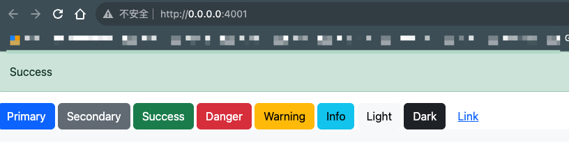

## 5. 在 Gemfile 中添加外部包

这里引入 bootstrap, https://getbootstrap.com/docs/5.3/getting-started/download/#rubygems


## 5.1. 在 Gemfile 中添加扩展

1. 编辑 `Gemfile`, 添加内容 bootstrap 支持， 并保存

+ https://github.com/twbs/bootstrap-rubygem
+ https://github.com/sass/sassc-rails

```ruby
# Gemfile
# 自定义 外部包
gem 'bootstrap', '~> 5.3.2'
gem 'sassc-rails'
```

2. 执行 bundle 更新依赖

```bash
$ bundle install
```

安装之后， 你会发现 Gemfile 和 Gemfile.lock 都变化了。

3. 重命名 `app/stylesheets/application.css` 为  `app/stylesheets/application.scss`， 注意后缀。

并在其中添加引用 bootstrap

```css
@import "bootstrap";
```

4. 为 `sassc-rails` 配置 development 环境变量, 

```ruby
# config/environments/development.rb
config.sass.inline_source_maps = true
```


## 5.2 在 view 页面上应用 bootstrap 效果。


在 `app/views/welcome/home.html.erb` 添加 bootstrap 内容， 参考 [**bootstrap v5**](https://getbootstrap.com/docs/5.3/components/navbar/) 


直接复制一下内容

```html
<div class="alert alert-success">
Success
</div>


<button type="button" class="btn btn-primary">Primary</button>
<button type="button" class="btn btn-secondary">Secondary</button>
<button type="button" class="btn btn-success">Success</button>
<button type="button" class="btn btn-danger">Danger</button>

```

启动服务， 打开首页。 效果如下, 则表示 bootstrap 引用成功了。




## 5.3. 编辑导航页面

删除 `app/views/welcome/home.html.erb` 中的所有内容， 复制粘贴 navbar 的内容。 

```ruby

<nav class="navbar navbar-expand-lg bg-body-tertiary">
  <div class="container-fluid">

    <div class="collapse navbar-collapse" id="navbarSupportedContent">
      <ul class="navbar-nav me-auto mb-2 mb-lg-0">

        <li class="nav-item">
          <a class="nav-link active" aria-current="page" href="#">网页</a>
        </li>

    <% ['微信', '知乎', '图片', '视频', '医疗', '汉语', '翻译'].each do |name| %>
        <li class="nav-item">
            <a class="nav-link" href="#"><%= name %></a>
        </li>
    <% end %>

      </ul>

    </div>
  </div>
</nav>

```

这里使用了 **数组** 的 `each` 循环。

```ruby
    <% ['微信', '知乎', '图片', '视频', '医疗', '汉语', '翻译'].each do |name| %>
        <li class="nav-item">
            <a class="nav-link" href="#"><%= name %></a>
        </li>
    <% end %>
```

很明显

1. erb 文件中，使用了 `<% %> ... <% end %>` 作为模版
2. 在模版中， 引用变量 `<%= ... %>` 注意左边的 `=`

